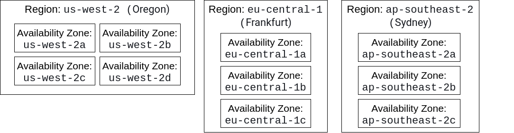
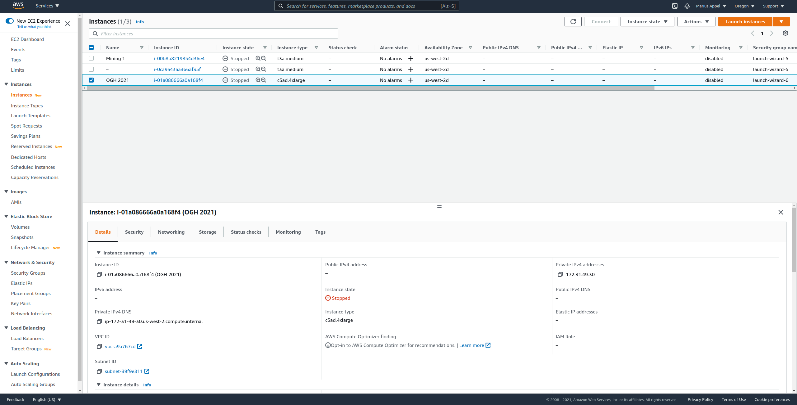
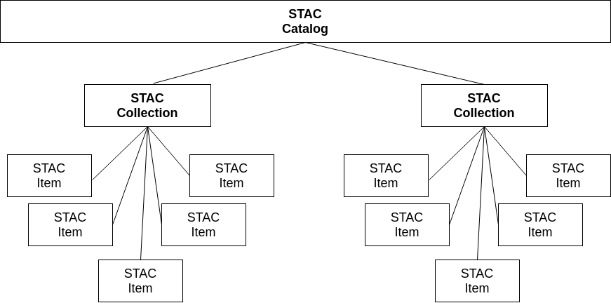
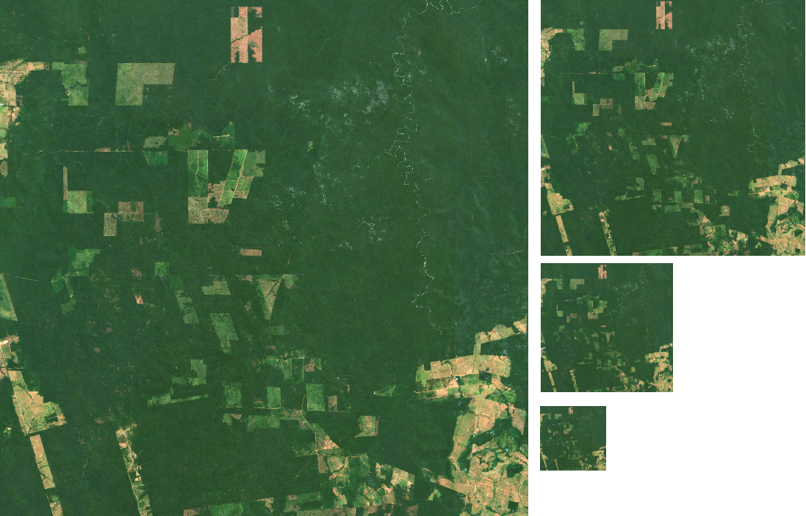
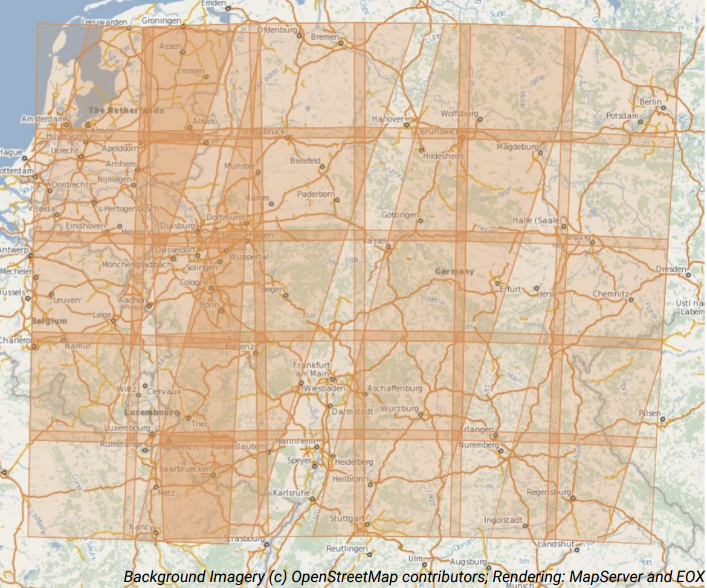
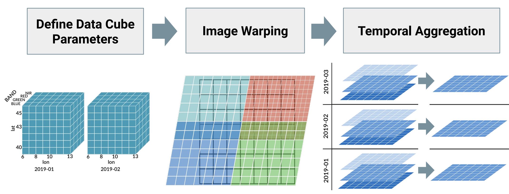
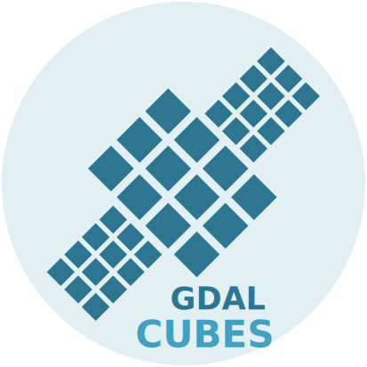

```{r setup, include=FALSE}
options(htmltools.dir.version = FALSE)
knitr::opts_chunk$set(
  fig.width=9, fig.height=3.5, fig.retina=3,
  out.width = "100%",
  cache = FALSE,
  echo = TRUE,
  message = FALSE, 
  warning = FALSE,
  hiline = TRUE,
  dev.args=list(bg = "transparent")
)
```

```{r xaringan-themer, include=FALSE, warning=FALSE}
library(xaringanthemer)
style_mono_accent(text_font_google = google_font("Roboto"),
                  header_font_google =  google_font("Roboto"),
  white_color = "#FBFBFC",
  base_color = "#4C566A",
  black_color = "#2E3440",
  inverse_background_color = "#2E3440",
  inverse_text_color = "#ECEFF4",
  #header_color = "#5E81AC",
  code_highlight_color = rgb(235/255, 203/255, 139/255, 0.5),
  link_color = "#BF616A",
  #header_background_color = "#D8DEE9"
  code_font_google = google_font("Roboto Mono"),
  header_h1_font_size = "2.20rem",
  header_h2_font_size = "2.0rem",
  header_h3_font_size = "1.75rem",
  text_font_size = "1.3rem",
  table_border_color = "#4C566A",
  table_row_border_color = "#4C566A",
  table_row_even_background_color = "#D8DEE9",
  extra_css = list(
  ".small" = list("font-size" = "75%"))
)
```

count: false
class: center middle

# Analyzing massive amounts of EO data<br/> in the cloud with R, gdalcubes, and STAC

### Marius Appel

### OpenGeoHub Summer School 2021 </br> Sept. 1, 2021

.pull-right[]

.pull-left[]


---


# Motivation


- Data availability (e.g. Sentinel-2) in the cloud

- Method availability (e.g. in R, > 18k CRAN packages)

- No time (frustration tolerance?) for downloading > 100 GB from data portals 

</br></br>

--


.center[**How to avoid data downloads and make use of the data and method availability ?**]

---


# Tutorial overview


**Objective:** Show **how** you can analyze satellite image collections in the cloud with R

1. **Introduction**: Cloud computing, EO data in the cloud, STAC, COG, and gdalcubes  
  
2. **Live examples**
  1. Creating composite images
  2. Complex time series analysis
  
3. **Discussion**


All **materials** are available on GitHub: [https://github.com/appelmar/ogh2021](https://github.com/appelmar/ogh2021).


---


## "... in the cloud"

**Services**: 
- [Google Earth Engine (GEE)](https://earthengine.google.com/)
- [Sentinel Hub](https://www.sentinel-hub.com/)
- [openEO backends](https://hub.openeo.org)
- ...

**Infrastructure providers**:
- Amazon web services (AWS)
- Google Cloud Platform
- Microsoft Azure
- Copernicus DIASes
- ...


In this tutorial, we will use a custom machine on AWS to analyze EO data _in the cloud_.

---

## Open EO data on cloud-computing platforms (examples)

</br></br>

| Provider | Data |
| -------- | -------------- |
| Amazon web services (AWS) | Sentinel, Landsat, ERA 5, OSM, CMIP 6, and more, see [here](https://registry.opendata.aws/?search=tags:gis,earth%20observation,events,mapping,meteorological,environmental,transportation)
| Google Cloud Platform | Landsat, Sentinel, [access to GEE data](https://developers.google.com/earth-engine/cloud/earthengine_cloud_project_setup)
| Copernicus DIASes | Sentinel + more (see [here](https://earsc.org/dias-comparison/))


---
class: inverse center middle

# Getting started with Amazon web services (AWS)


---


## AWS overview

- Lots of separate data centers with large clusters



- In total: 25 regions and 81 availability zones
- Basic service to run (virtual) machines: EC2 (Amazon Elastic Compute Cloud)


---

## Basic steps to run a machine on AWS

1. Select a region and [machine instance type](https://aws.amazon.com/de/ec2/pricing/on-demand), based on costs, hardware, and OS

2. Create a key pair for accessing the machine over SSH

3. Click "Launch instance" and follow instructions

4. Connect via SSH and install software (PROJ, GDAL, R, RStudioServer<sup>1</sup>, R packages, ...)


_Notice that security considerations (e.g. by using IAM roles, multi-factor authorization) are **NOT** part of this tutorial._


.footnote[<sup>1</sup> You need to add a security rule to allow public / protected access to RStudioServer.]


---


## AWS Management Console

.center[
[](https://us-west-2.console.aws.amazon.com/console/home?region=us-west-2)
]

---
class: inverse center middle

# EO data in the cloud


---

## Object Storage: S3

EC2 machines have local storage (EBS) but big data archives use highly scalable **object storage**.

S3 elements:

- **Bucket**: container for objects that is stored in a specific AWS region 
- **Objects**: Individual files and corresponding metadata within a bucket, identified by a unique key
- **Key**: Filenames / Path or similar; unique within a bucket

Pricing (storage, transfer, requests):

- Bucket owner pays by default
- For **requester pays** buckets, transfer and requests are paid by users


---

## Examples

Buckets:
- https://registry.opendata.aws/sentinel-2
- https://registry.opendata.aws/usgs-landsat/


Object:

.small[
- http://landsat-pds.s3.amazonaws.com/L8/003/017/LC80030172015001LGN00/LC80030172015001LGN00_B9.TIF
]


---

## Accessing imagery

- Buckets are **not** a drive on your machine
- Data access over HTTP requests (PUT, GET, DELETE, ...)


### Challenges

1. How to find images by location, time, and other criteria? 

2. How to efficiently read image data from S3 without copying images to our machine storage first? 


---
class: inverse center middle

# Cloud-native satellite imagery access<br/>with STAC-API and COGs


---

## STAC

.pull-left[
- standardized JSON-based language for describing catalogs of **spatiotemporal** data (imagery, point clouds, SAR)

- extensible (available extensions include EO, Data Cubes, Point Clouds, and more)

- 1.0.0 release available since May 2021

- growing ecosystem
]

.pull-right[</br></br>
]


---

## STAC


.center[

]

- **Items** are inseparable objects of data (assets) and metadata (e.g. a single satellite image)
- **Catalogs** can be nested
- **Collections** extend catalogs and can be used to group items and their metadata (e.g. license)


---

## STAC

**Static STAC catalogs**

- Typically set of linked JSON files, starting with a `catalog.json`
- Catalog JSON contains links to collections, nested catalogs, or items
- Items contain assets (links to files) and metadata 
- Problem: All items must be processed for searching
- Example: https://landsat.stac.cloud/?t=catalogs*


**STAC API**

- Web-service for dynamic search of STAC items by area of interest, datetime, and other metadata
- Compliant with OGC API - Features standard

**STAC Index**

- A good starting point to find available STAC collections and API services: https://stacindex.org


---


## Cloud-optimized GeoTIFF (COG)

**Image file formats must be cloud-friendly to reduce transfer times and costs associated with transfer and requests**

.pull-left[
- COG = Normal **tiled** **GeoTIFF** files whose content follows a **specific order of data and metadata** ([see full spec here](https://github.com/cogeotiff/cog-spec/blob/master/spec.md))

- support compression

- support efficient **HTTP range requests**, i.e. partial reading of images (blocks, and overviews) over cloud storage
]
.pull-right[


- may contain overview images (image pyramids) 

.center[
]
]

- [GDAL](https://gdal.org/) can efficiently read and write COGs, and access object storage in the cloud with [_virtual file systems_](https://gdal.org/user/virtual_file_systems.html)


---
class: inverse center middle

# On-demand data cubes with the gdalcubes library


---

## Satellite image collections

.pull-left[

]
.pull-right[
</br></br>
Images spatially overlap, have different coordinate reference systems, have different pixel size depending on spectral bands, yield irregular time series for larger areas
]


---

## What is a data cube?

Here: **A four-dimensional (space, time, variable / band) regular raster data cube**


- collect all observations in one object
- $b \times t \times y \times x \rightarrow$ real value
- single CRS, cells have constant temporal duration, and spatial size


---

## Data Cube creation is lossy



**There is no single correct data cube!**

---

## `gdalcubes` 

- Open source C++ library and R package available [from CRAN](https://cran.r-project.org/package=gdalcubes)

- Creation and processing of data cubes from satellite image collections<sup>1</sup> 

- Image data is read on the fly, when needed (lazy evaluation), multithreaded, chunk-wise

- Uses [GDAL](https://gdal.org/) to read and warp data

- Additional features: user-defined R functions on pixels / pixel time series, pixel masking combining data from different image collections


.center[]


.small[
.footnote[<sup>1</sup> Appel, M., & Pebesma, E. (2019). On-demand processing of data cubes from satellite image collections with the gdalcubes library. Data, 4(3), 92.]]


---
class: inverse center middle

# Live examples<br/>

see [https://appelmar.github.io/ogh2021/tutorial.html](https://appelmar.github.io/ogh2021/tutorial.html)


---

class: inverse center middle

# Discussion


---

## Pros and cons of EO data analysis in the cloud

Workflow is based on the existence of STAC-API services and imagery as COGs!

.pull-left[
### Advantages

- Access to huge data archives

- Flexibility: You can do whatever you can do on your local machine

- Powerful machines available

- Open source software only
]

.pull-right[
### Disadvantages

- Not free

- GEE and others are easier to use (some are free)

- Your institution's computing center might have more computing resources (_for free_)

- Setup and familiarization needed
]

---


## Summary

- Cloud-computing platforms contain lots of open EO data

- Cloud storage differs from local storage

- Technology and tools: 

  - STAC (and STAC API!) for efficient and standardized search of spatiotemporal EO data
  
  - COGs allow efficiently reading parts of imagery, potentially on lower resolution
  
  - GDAL has everything for efficient data access on cloud storage
  
  - gdalcubes makes the creation and processing of data cubes from satellite image collections in R easier
  


---
class: center middle

# Thanks!


**Slides and Notebook:**

https://github.com/appelmar/ogh2021

**Contact:**

[@appelmar](https://twitter.com/appelmar)</br>
[marius.appel@uni-muenster.de](mailto:marius.appel@uni-muenster.de)


.small[
_Slides created via the R packages: _[xaringan](https://github.com/yihui/xaringan), [_gadenbuie/xaringanthemer_](https://github.com/gadenbuie/xaringanthemer)]


